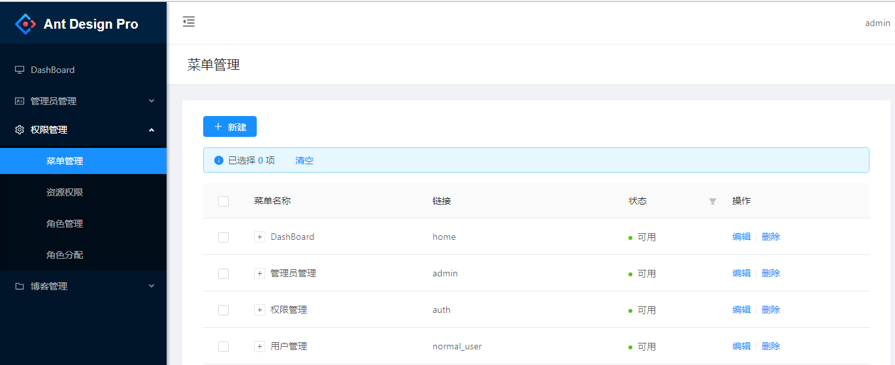
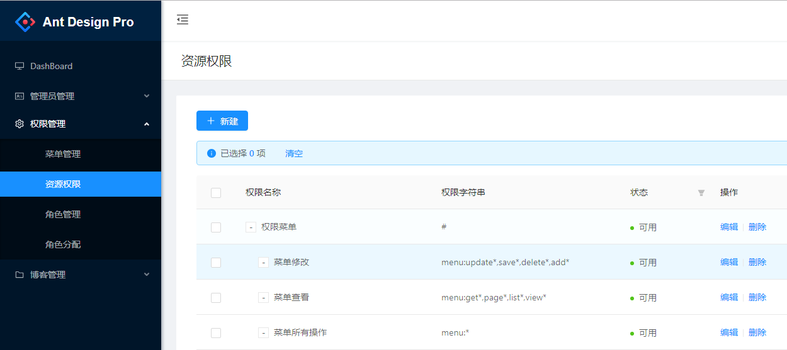
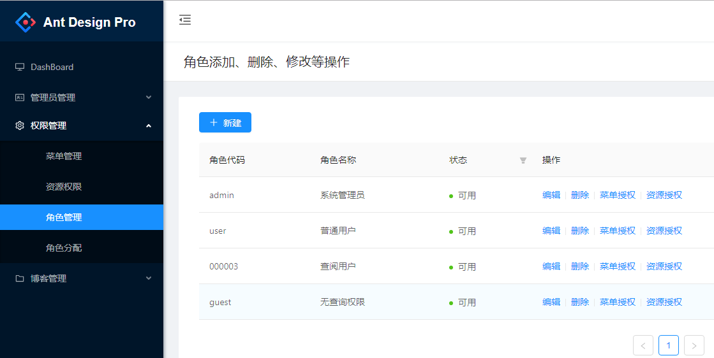
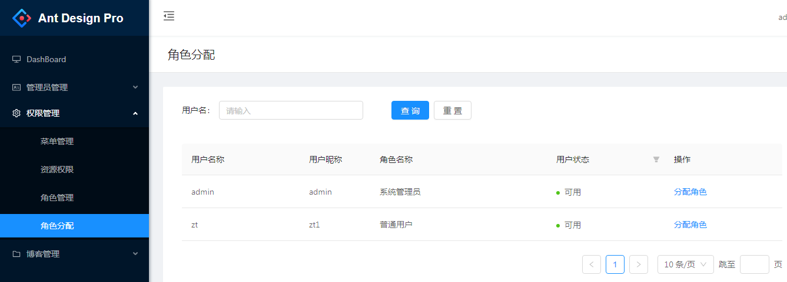
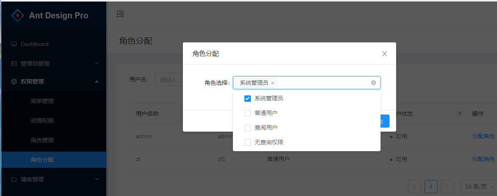

# react-authority

基于ant-design-pro的简易权限系统

配合 [springboot-shiro](https://github.com/ztgreat/springboot-shiro) 一起使用的demo，也可以配合 [springboot-security](https://github.com/ztgreat/springboot-security) 使用

### 菜单管理

### 资源权限

### 角色管理

可以给每个角色分配菜单和资源

### 角色分配

